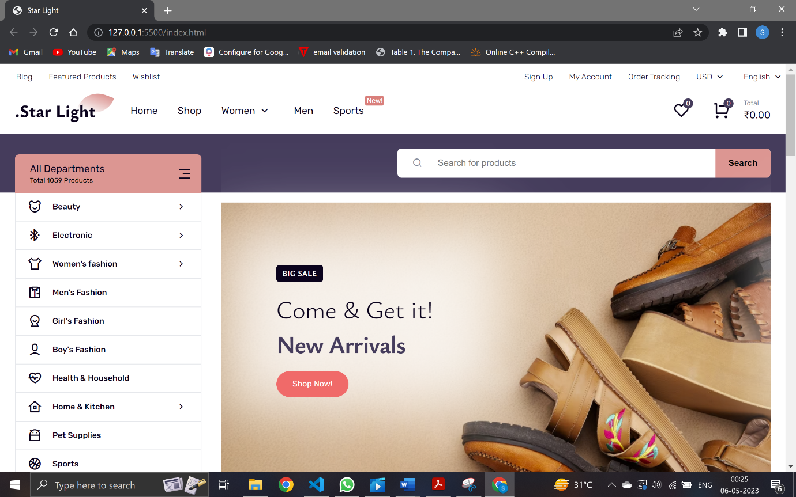
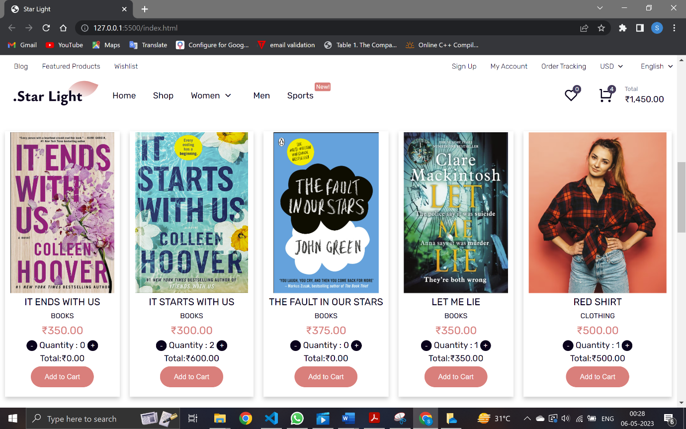
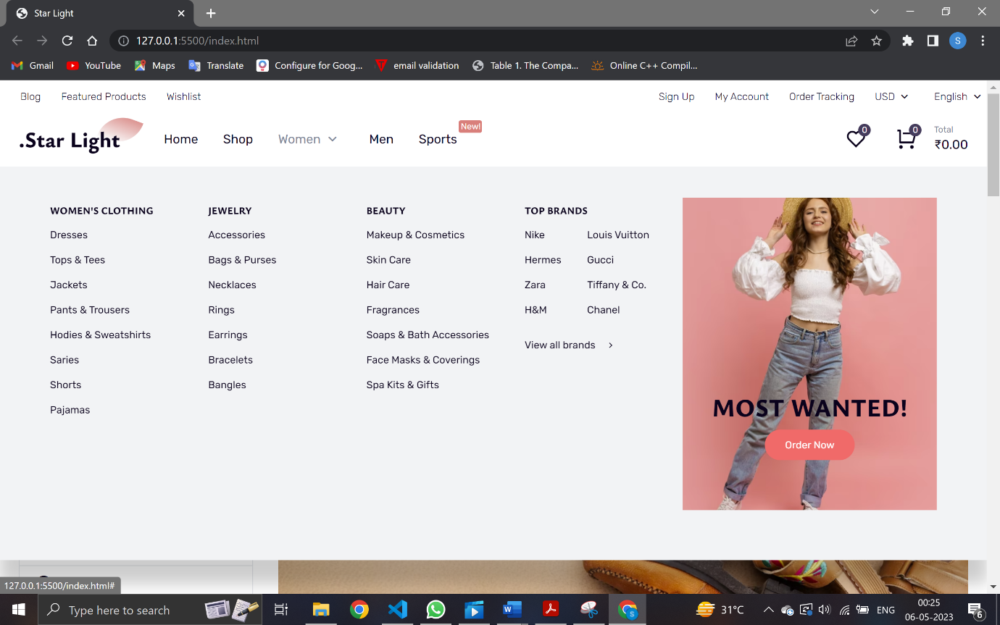
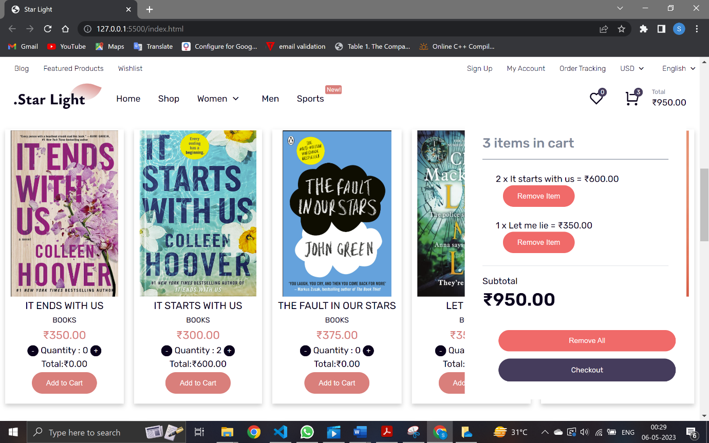
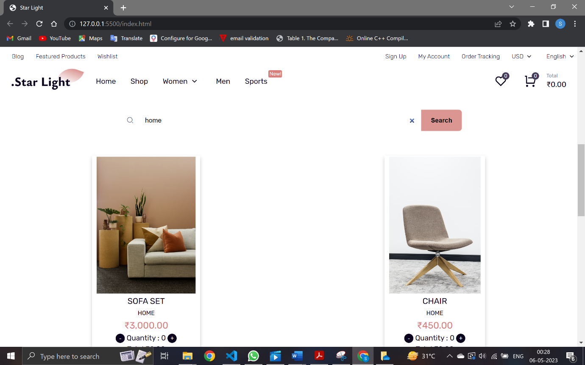
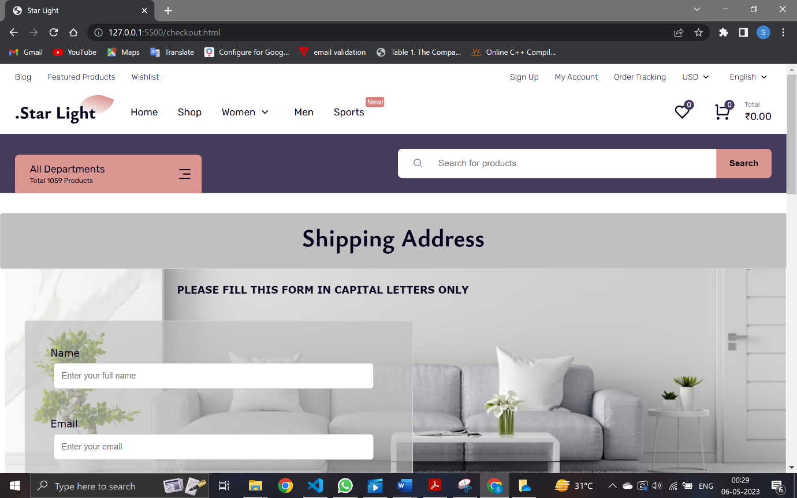
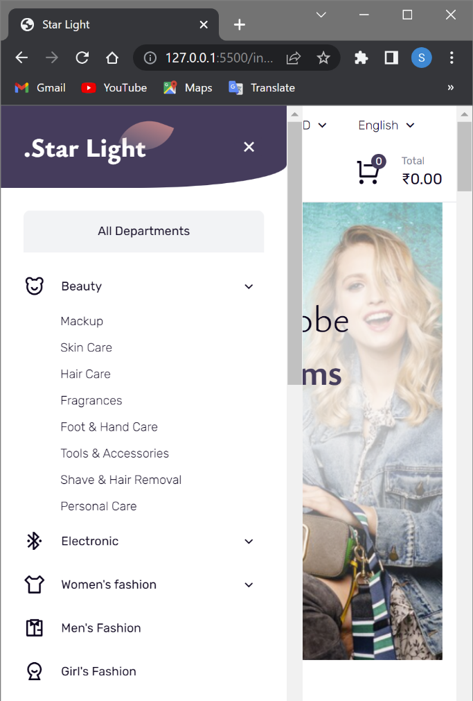

# Star-Light-a-shopping-website-clone

## Overview
This project is a clone of a shopping website, created using HTML, CSS, JavaScript, and AngularJS. It includes various functionalities such as homepage, cart, search, and checkout to provide a complete shopping experience.

## Features
- **Homepage**: Displays a list of products with images, descriptions, and prices.
  
  
  
  
  
 
- **Cart**: Allows users to add, remove, and update items in the cart with real-time updates.

  

  
- **Search**: Integrated real-time product search functionality.

  
  
  
- **Checkout**: Robust form validation to ensure accurate user information during the checkout process.

  
  

- **Responsive Design**: Ensures optimal user experience across different devices.

  
  
 
## Technologies Used
- **HTML**: For structuring the content on the web pages.
- **CSS**: For styling the web pages to make them visually appealing.
- **JavaScript**: For adding interactivity to the website.
- **AngularJS**: For backend functionality and managing dynamic data.
